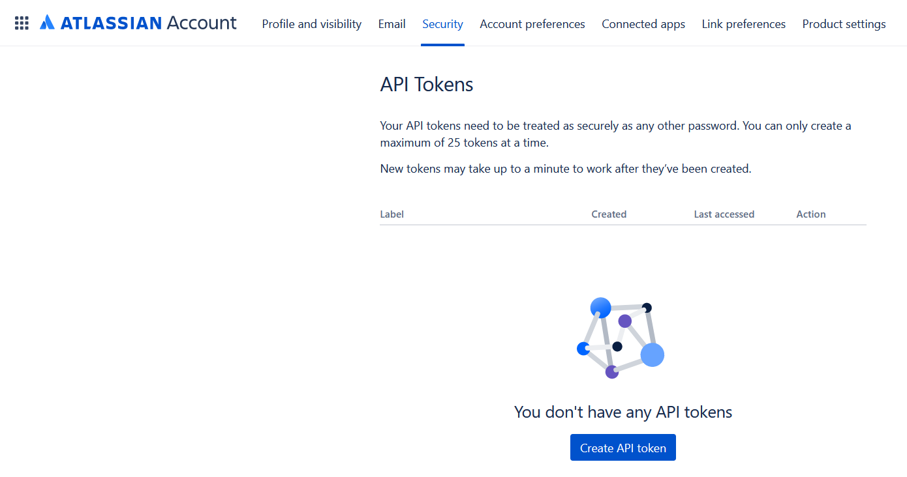
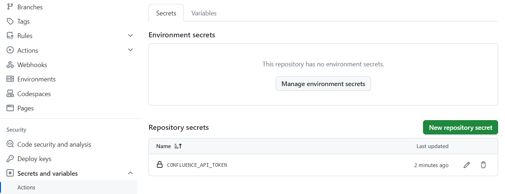

# Publish to Confluence GitHub Action

- [Action Proposal](#action-proposal)
- [Setup](#setup)
- [Inputs](#inputs)
- [Usage](#usage)
- [To Do](#to-do)

## Action Proposal

This GitHub Action, named "Publish to Confluence", is designed to create a release page in Confluence with the release notes. The action fetches the release notes from a GitHub release and then posts them to a specified Confluence page.

## Setup

1. Create API token in Confluence:
   - Go to your Atlassian account settings.
   - Click on "Security" in the left-hand menu.
   - Click on "Create and manage API tokens".
   - Click on "Create API token".
   - Enter a label for your token.
   - Click on "Create".
   - Copy the token and save it in a secure location.  
     Doc: <https://support.atlassian.com/atlassian-account/docs/manage-api-tokens-for-your-atlassian-account/>
     
2. Add the API token to your GitHub repository secrets:
   - Go to your GitHub repository.
   - Click on "Settings".
   - Click on "Secrets and variables" > "Actions".
   - Click on "New repository secret".
   - Enter "CONFLUENCE_API_TOKEN" in the "Name" field.
   - Paste the API token in the "Value" field.
   - Click on "Add secret".
   
3. Add the email address associated with your Confluence account to your GitHub repository secrets:
    - Go to your GitHub repository.
    - Click on "Settings".
    - Click on "Secrets and variables" > "Actions".
    - Click on "Variables".
    - Click on "New repository variable".
    - Enter "CONFLUENCE_EMAIL" in the "Name" field.
    - Enter the email address associated with your Confluence account in the "Value" field.
    - Click on "Add variable".
4. Create a Confluence page to serve as the parent page for the release pages and note down the page ID (`parentId`).  
`https://<cloud-id>.atlassian.net/wiki/spaces/<space>/pages/<parentId>/<title>`  
5. Get the space ID of the Confluence space where the release page will be created:
   - Go to the Confluence space.
   - Click on "Space settings" > "Space details".
   - Note down the space `Key` from the URL:
   `https://<cloud-id>.atlassian.net/wiki/spaces/viewspacesummary.action?key=<space-key>`
   - Sent the space key to the following API to get the space ID:
   ```bash
    curl --request GET \
    --url 'https://<cloud-id>.atlassian.net/wiki/rest/api/space/<space-key>' \
    --user 'email@example.com:<api_token>' \
    --header 'Accept: application/json'
   ```
   200 Response
   ```json
    {
        "id": "123456789", << This is a spaceId
        "key": "<space-key>",
        "name": "Space Name",
        "type": "global",
        "status": "current",
        ...................
    }
   ```

## Inputs

The action requires the following inputs:

| Name                 | Description                                                                 | Required | Default                           |
|----------------------|-----------------------------------------------------------------------------|----------|-----------------------------------|
| `spaceId`            | The ID of the Confluence space where the release page will be created.      | True     | -                                 |
| `status`             | The status of the page to be created.                                       | True     | -                                 |
| `title`              | The title of the page to be created.                                        | True     | -                                 |
| `parentId`           | The ID of the parent page under which the new page will be created.         | True     | -                                 |
| `ConfluenceBaseUrl`  | The base URL of your Confluence instance.                                   | True     | -                                 |
| `tag`                | The tag of the GitHub release from which the release notes will be fetched. | True     | -                                 |
| `confluence_email`   | The email address associated with your Confluence account.                  | True     | -                                 |
| `confluence_api_token`| The API token for your Confluence account.                                  | True     | -                                 |
| `appName`            | The name of the application for which the release is being made.            | True     | -                                 |
| `ConfluenceSpaceKey` | The key of the Confluence space where the release page will be created.     | False     | -                                 |
| `repoOwner`          | The owner of the GitHub repository from which the release notes will be fetched. | True | -                                 |
| `repoName`           | The name of the GitHub repository from which the release notes will be fetched. | True | -                                 |

## Usage

To use this action in your GitHub workflow, add the following step:

```yaml
- name: Publish to Confluence
  uses: uses: Gershon-A/publish-release-to-confluence@v1.0.0
  with:
    spaceId: '<spaceId>'
    status: '<status>'
    title: '<title>'
    parentId: '<parentId>'
    ConfluenceBaseUrl: '<ConfluenceBaseUrl>'
    tag: '<tag>'
    confluence_email: '<confluence_email>'
    confluence_api_token: '<confluence_api_token>'
    appName: '<appName>'
    ConfluenceSpaceKey: '<ConfluenceSpaceKey>'
    repoOwner: '<repoOwner>'
    repoName: '<repoName>'
```

Example:

```yaml
  create-confluence-page:
    runs-on: ubuntu-latest
    needs: [ release ]
    steps:
      - name: Publish to Confluence Action
        uses: Gershon-A/publish-release-to-confluence@v1.0.0
        with:
          confluence_email: ${{ vars.CONFLUENCE_EMAIL }}
          confluence_api_token: ${{ secrets.CONFLUENCE_API_TOKEN }}
          spaceId: '223903751'
          status: 'current'
          title: "Release: ${{ github.ref_name }}"
          parentId: '556597266'
          ConfluenceBaseUrl: 'https://smart-cooking.atlassian.net'
          repoOwner: ${{ github.repository_owner }}
          repoName: ${{ github.event.repository.name }}
          tag: ${{ github.ref_name }}
          appName: ${{ github.event.repository.name }}

```

    Replace the placeholders (<...>) with your actual values.

## To Do

1. Add support for customizing the release notes template.
2. Add support for customizing the page template.
3. Add support for page labels.
4. Add support for updating existing pages.
